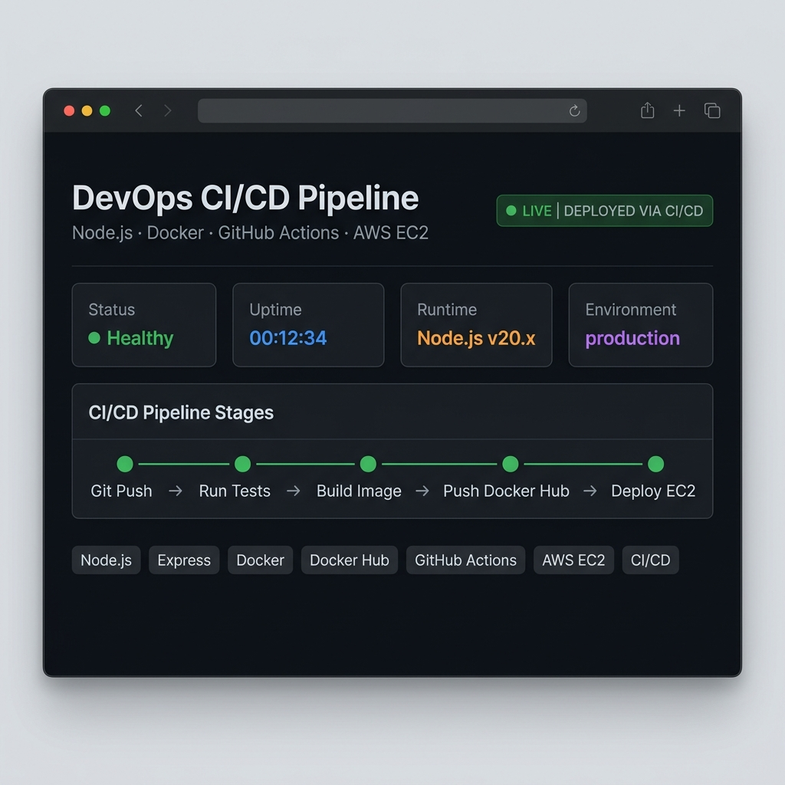
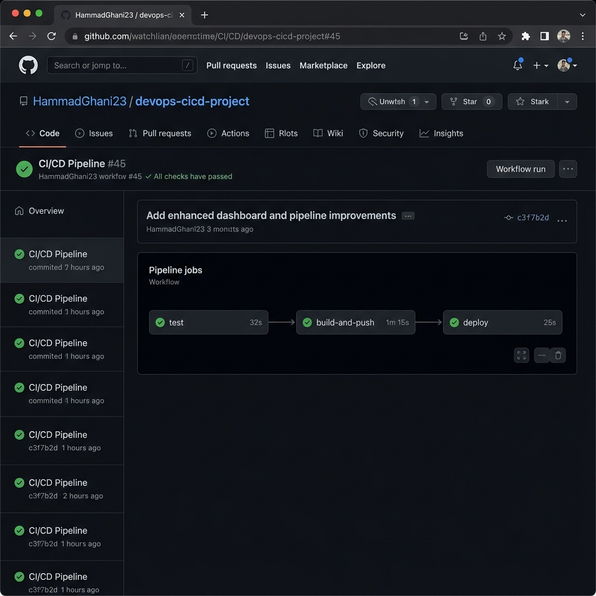
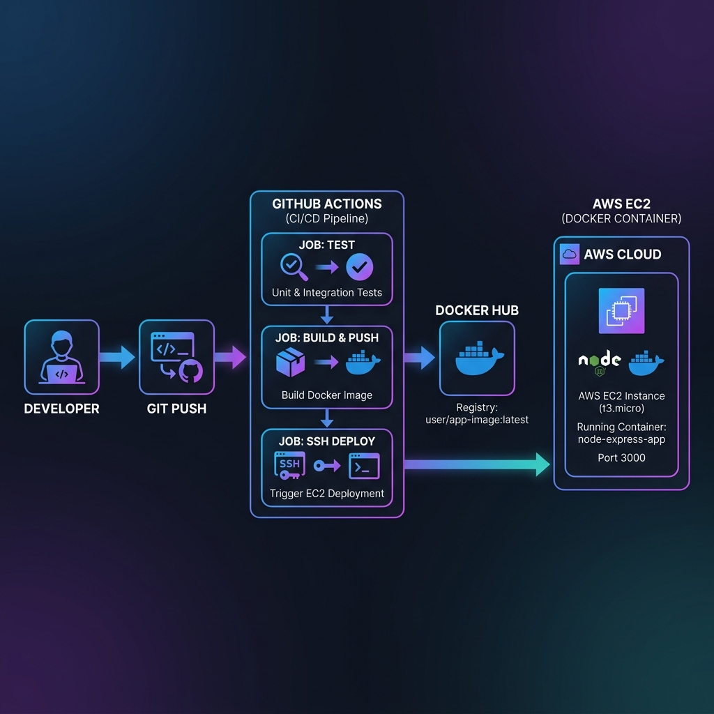

<div align="center">

# 🚀 DevOps CI/CD Pipeline Project

<p>
  <a href="https://github.com/HammadGhani23/devops-cicd-project/actions/workflows/ci-cd.yml">
    
  </a>
  
  
  
  
  
</p>

<p>A production-ready Node.js Express application with a <strong>fully automated CI/CD pipeline</strong>.<br/>
Every push to <code>main</code> automatically tests, builds a Docker image, pushes to Docker Hub, and deploys to AWS EC2.</p>

**[▶ View Live Demo](http://13.51.238.181:3000)** &nbsp;|&nbsp; **[Health Check](http://13.51.238.181:3000/health)** &nbsp;|&nbsp; **[System Info](http://13.51.238.181:3000/info)**

</div>

---

## 📸 Screenshots

### Live Application Dashboard


### GitHub Actions CI/CD Pipeline


> **How to add real screenshots:**
> 1. Start your EC2 instance and visit `http://<your-ec2-ip>:3000` in a browser
> 2. Press `F12` → Device Toolbar → set width to 1280px, take screenshot
> 3. Replace `docs/screenshot-app.png` and `docs/screenshot-pipeline.png` with your real screenshots
> 4. For the pipeline screenshot: go to your **GitHub repo → Actions tab** → click a successful run → screenshot and replace

---

## 🏗️ Architecture

```
Developer
    │
    │  git push origin main
    ▼
┌─────────────────────────────────────────┐
│           GitHub Repository              │
│                                         │
│  Triggers GitHub Actions Workflow       │
└──────────────┬──────────────────────────┘
               │
    ┌──────────▼──────────┐
    │    Job 1: Test       │  npm ci + npm test
    │    (ubuntu-latest)   │
    └──────────┬──────────┘
               │ on success
    ┌──────────▼──────────┐
    │ Job 2: Build & Push  │  docker build + push → Docker Hub
    │    (ubuntu-latest)   │
    └──────────┬──────────┘
               │ on success
    ┌──────────▼──────────┐
    │  Job 3: Deploy       │  SSH → EC2 → docker pull + run
    │    (ubuntu-latest)   │
    └──────────┬──────────┘
               │
    ┌──────────▼──────────┐
    │   AWS EC2 Instance   │  App live at port 3000
    │   (Ubuntu Server)    │
    └─────────────────────┘
```



---

## 🛠️ Tech Stack

| Tool | Purpose |
|---|---|
| **Node.js + Express** | Web application runtime & framework |
| **Docker** | Containerize the application |
| **Docker Hub** | Container image registry |
| **GitHub Actions** | CI/CD automation pipeline |
| **AWS EC2** | Cloud server for live deployment |
| **SSH (appleboy)** | Secure remote deployment to EC2 |

---

## 📂 Project Structure

```
devops-cicd-project/
├── .github/
│   └── workflows/
│       └── ci-cd.yml        # GitHub Actions CI/CD pipeline
├── docs/
│   ├── architecture.png     # Architecture diagram
│   ├── screenshot-app.png   # Live app screenshot
│   └── screenshot-pipeline.png # Pipeline screenshot
├── index.js                 # Express app (dashboard + API)
├── Dockerfile               # Container definition
├── .dockerignore
├── .gitignore
└── package.json
```

---

## ⚙️ CI/CD Pipeline Explained

The pipeline has **3 sequential jobs** defined in [`.github/workflows/ci-cd.yml`](.github/workflows/ci-cd.yml):

```
push to main  ──▶  test  ──▶  build-and-push  ──▶  deploy
```

### Job 1 — `test`
- Checks out code
- Sets up Node.js 20 with npm cache
- Runs `npm ci` (clean install)
- Runs `npm test`

### Job 2 — `build-and-push`
- Runs only if `test` passes
- Logs in to Docker Hub using secrets
- Builds the Docker image
- Pushes to Docker Hub as `<username>/devops-cicd-project:latest`

### Job 3 — `deploy`
- Runs only if `build-and-push` passes
- SSH connects to AWS EC2 using private key secret
- Pulls the latest Docker image
- Stops and removes old container
- Starts new container on port 3000 with `--restart unless-stopped`

---

## 🚀 Getting Started

### Running Locally (without Docker)

```bash
git clone https://github.com/HammadGhani23/devops-cicd-project.git
cd devops-cicd-project
npm install
npm start
# App running at http://localhost:3000
```

### Running with Docker Locally

```bash
# Build the image
docker build -t devops-cicd-project .

# Run the container
docker run -d -p 3000:3000 --name devops-app devops-cicd-project

# Visit http://localhost:3000
```

### Setting Up the CI/CD Pipeline

To use this pipeline in your own deployment, add the following **GitHub Secrets** to your repository (`Settings → Secrets and variables → Actions`):

| Secret Name | Description |
|---|---|
| `DOCKERHUB_USERNAME` | Your Docker Hub username |
| `DOCKERHUB_TOKEN` | Docker Hub access token (not password) |
| `VM_HOST` | Public IP of your EC2 instance |
| `VM_USER` | EC2 SSH username (e.g., `ubuntu`) |
| `VM_SSH_KEY` | Full contents of your EC2 `.pem` private key |

---

## 🌐 API Endpoints

| Method | Endpoint | Description |
|---|---|---|
| `GET` | `/` | Live dashboard (HTML) |
| `GET` | `/health` | JSON health check |
| `GET` | `/info` | System information JSON |

**Example `/health` response:**
```json
{
  "status": "healthy",
  "timestamp": "2024-01-15T10:30:00.000Z",
  "uptime": 3600.5,
  "version": "v20.11.0"
}
```

---

## 🔒 Security Practices

- No credentials hardcoded — all sensitive data stored in **GitHub Secrets**
- Docker image uses `node:18-alpine` (minimal attack surface)
- Container runs with `--restart unless-stopped` for auto-recovery
- `.dockerignore` excludes `node_modules` and other unnecessary files

---

## 📄 License

ISC © [HammadGhani23](https://github.com/HammadGhani23)
